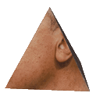

	
	<h1 >obama.solutions</h1>

---

This repository fosters the source code of the most autistic website on earth, it is written in pure HTML and CSS with some JS here. Some pages here are written in Markdown and have to be compiled using a SSG, in our case we use [based-ssg](https://github.com/alloca123/based-ssg) by our fellow Alloca.

We tried to rip off [uwu.network](https://uwu.network) but it didn't really work, specially since we were using Asstro, so we just made stuff in stock CSS and called it a day.

**deployment**
All source code is stored in `src/`, you kinda just drop this folder in your `www/` folder on your webserver thing, and also make sure to copy `ast/` over inside `src/` when doing so.

As for based-ssg stuff I honestly have no fucking idea that's dealt with by Cam.
