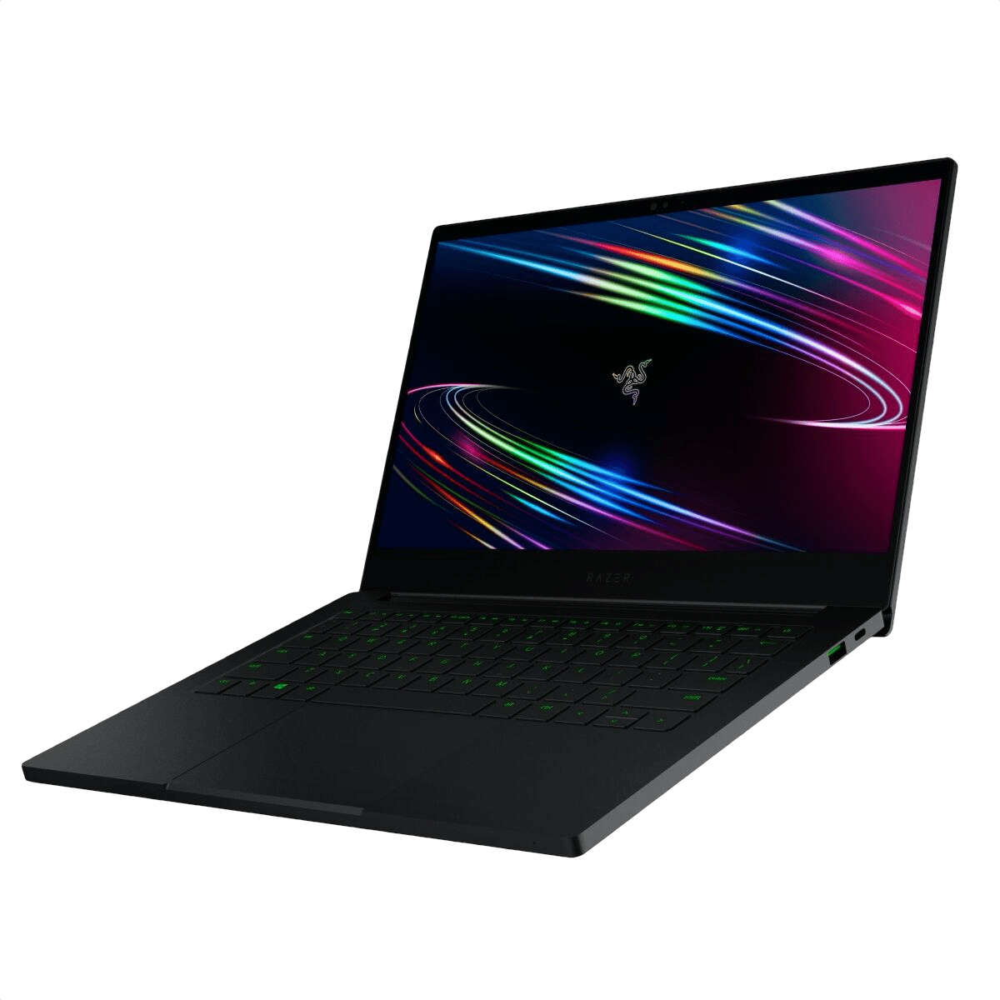
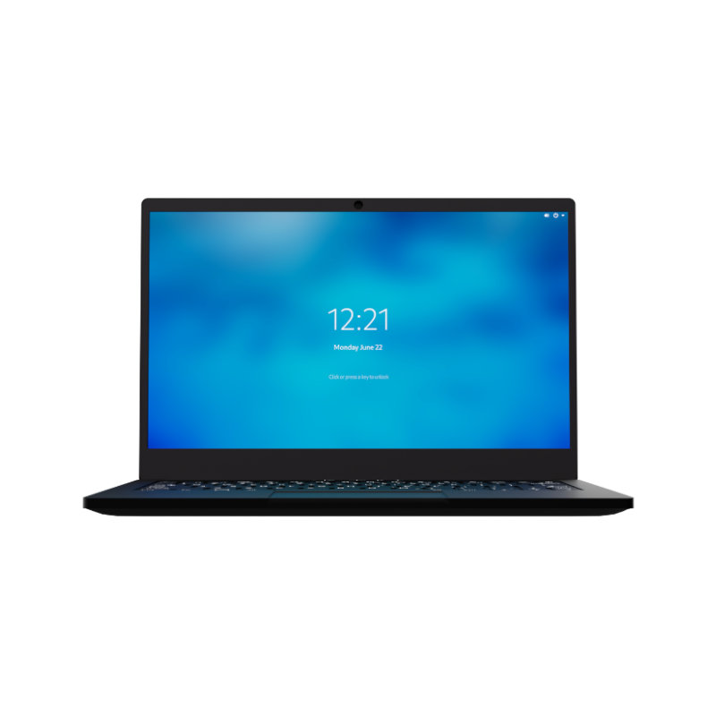
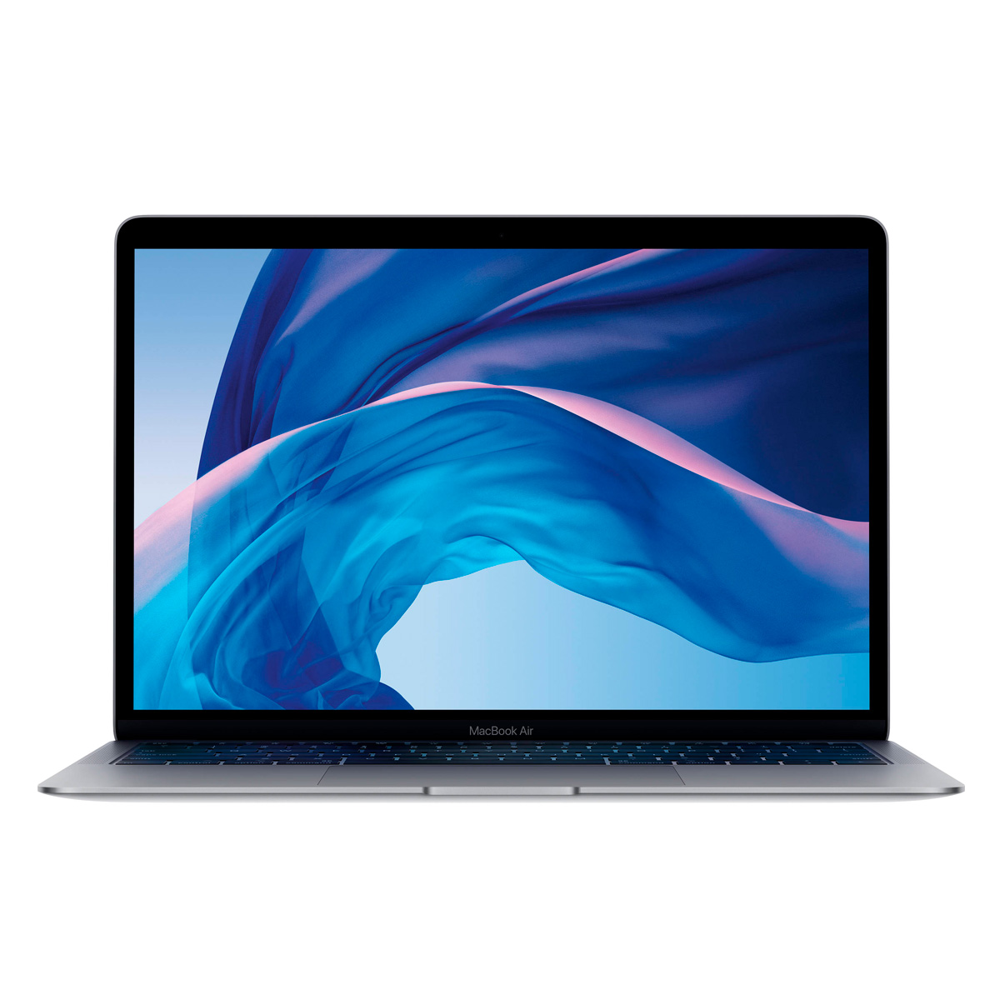
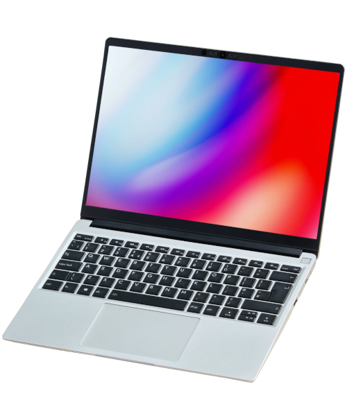

# The journey of finding a new laptop.

My 2020 Huawei Matebook D15 (pictured above) is starting to show its age (yes, a 2020 laptop is already dying in 2022. story of my life), having issues with tasks such as rendering a 2-minute video in 720p or opening more than 8 tabs in Chrome. All of this while praying that the shitty cooling system doesn't decide to make my computer a soldering iron.

So, it's time to find a new laptop, but which one?

## The Requirements

Finding a laptop that can replace my current one is, of course, a duty that takes some time where you analyze a bunch of products and wastes time watching paid reviewers.

And due to that, I decided to make a simple set of requirements for my new computer so that it fits my uses.

### The Requirements

- Laptop/Screen size has to be under 14", 13" models are preferred
- The design has to look slick and portable while being powerful enough to be considered a "nomad workstation"
  - No "bulky" laptops that everyone knows that they're just watered-down Desktops with a screen and keyboard attached to them.
  - Design shall not compromise the lifespan/performance of the laptop, if the laptop needs proper cooling; then it shall get a case/body that can provide proper airflow

- Decent GNU+Linux support
- At least 16GB of RAM
- Storage must be an SSD with more than 256GB of Storage (NVMe is preffered)
- No 2-in-1 Laptops
- All laptops must come refurbished or brand new from the manufacturer, so no old Thinkpads that I need to repair on my own.

If possible:

- OLED Screen
- An HDMI port
- Ethernet port (can't believe I really have to add this but here we're, in the world where everything is USB-C)

## The Candidates

With all of these requirements laid out, I've decided to compile a list of possible candidates for my next daily driver for the next 3 to 5 years.

But before I list all of them, I need to layout what practically are shopping guidelines for the list, the layout is the following:

- While there is no real price limit, it's preferable for the device to be under 1500€ to fit standard budgets (I want this article to be used by others so that they can form their own kind of lists and opinions)
- If the manufacturer offers customization options (say more RAM or Storage), I shall tune the customization options to my liking, not to satisfy the bare minimum for the standard requirements unless specified so
- All products shall ship with the Spanish ISO layout or the German ISO layout (this is not obligatory but it is preferred)
- I'm allowed to "skip" and "bypass" the requirements for any reason of my liking

### Razer Blade Stealth 13 (2021)

The **Razer Blade Stealth** is Razer's offer to the business market, the design is sleek and tackles my obsession for unibody matte black designs that ThinkPad's have been on for years.

These are the Blade Stealth's technical specifications (no touch screen model):

- Intel i7-1165G7
- NVidia GeForce GTX 1650 Ti
- 16GB RAM 
- 512GB SSD
- 1320€ as of November 30th, 2021 (from Razer.com)

This model fits my needs perfectly, it has a nice industrial design that I'm obsessed with and the specs are overall amazing. But I do have some pet peeves with it.

First of all, as I specified on the "standards" above, I'm looking for a laptop with decent Linux support, something that the Blade Stealth doesn't comply with too much due to its inclusion of the GTX 1650 Ti GPU which along with other NVidia products, their drivers on GNU+Linux fucking suck. 

Another problem I have with it comes from the brand itself, Razer. Razer is known for making peripherals and hardware with stuff like RGB and Macros, which (normally) have to be controlled with a specialized software made by Razer, Razer does not ship official drivers for GNU+Linux as of 2021. But fortunately, the community got us covered with software like [OpenRazer](https://github.com/openrazer/openrazer) to solve this problem. But alas, this effort and the small issue wouldn't have existed in the first place if Razer supported GNU+Linux. :^).

So, to finish it off:

Pros:

- Amazing technical specs with a beefy GPU and CPU that will make my day-to-day tasks a breeze
- Amazing body design that fulfills my love for unibody matte black frames
- Decent Quality-Price ratio
- IT HAS AN OLED DISPLAY

Cons:

- Uses NVidia and Razer's own proprietary garbage
- Doesn't have Ethernet
- Seems to only carry ANSI keyboards

### Purism Librem 14 (v1)

The **Purism Librem 14** is Purism's flagship product (along with the Librem 5), known for making privacy-conscious hardware and software, the Librem 14 is Purism's latest laptop featuring physical kill switches for Networking, Webcam, and Microphone along being an "open source and privacy" focused laptop.

These are the Librem 14's technical specifications (customized to fit standard requirements and to my liking):

- Intel i7-107110U
- Intel UHD 620
- 16GB Dual-Channel DDR4 RAM
- 500GB NVMe SSD
- 1637€ as of November 30th, 2021 (from Puri.sm)

Now, this IS an enthusiast laptop; more than the Framework (which I'll talk about below). And it shows it with pride, both on the price tag and their website. As of Purism's own words, they're not your average for-profit company; but a social purpose corporation.

Purism also claims that all of the laptop's internals and firmware is open source and fully customizable. Due to this, the Librem 14 gets a good note on my books and a decent score on the candidates list.

And to finish everything off:

Pros:

- Decent hardware that is meant to be as OSS as possible
- Comes with [IME](https://en.wikipedia.org/wiki/Intel_Management_Engine) disabled out of the box
- Made by a group of people that just want to sell nice laptops to people
- Has a good ports arrangement; includes an Ethernet jack alongside an HDMI port and a MicroSD reader
- Physical kill switches for extra privacy!
- Would work well as a workstation that you can take around the house (perfect for my usecase!)

Cons:

- It's an enthusiast's laptop, don't expect top-tier performance and build quality.
- Purism has a shady history of scamming customers
- Only comes in English ANSI

### Apple Macbook Air (2020)

The **Apple Macbook Air** is Apple's lightweight/entry-level laptop for their Machintosh line of computers, being the OG that everyone knows about. I don't think I have to present it or anything.

These are the Macbook Air's technical specifications (top-of-the-line model):

- Apple M1 (8 Cores for CPU and 8 cores for GPU)
- 16GB RAM
- 512GB SSD
- 1230€ as of November 30th, 2021 (from Apple.com)

Now, I'd normally skip overlooking Apple products or products that won't run GNU+Linux for some reason. But Apple made a laptop that even a Linux enthusiast like me loves.

The design is sleek, like the one of every Apple product made after 2015. The aluminum chassis that I love so much is sharp and light while retaining a certain feeling of build quality. The size and form factor is perfect for my use case of needing something highly portable while having top-of-the-line specifications and being portable enough that I can carry it on a 15" backpack with no issues.

But of course, this is an Apple product, a new one that runs on Apple's M1 chip; an SoC that practically no distro supports (well, properly). Something that would lock me down to using macOS (which I don't have a problem with but I like using GNU+Linux more). And to add to all the limitations the hardware comes out of the box, all of the components that I'd like to replace at some point are soldered (RAM and Storage). All of this caused the 2020 Macbook Air to get consideration as a candidate, but not being all that up in the list.

To kick it off:

Pros:

- Fast Hardware that knowing Apple's track record of laptops, will last me a long time.
- Sleek design that is highly portable while being powerful enough
- I love Retina screens
- Can be bought in Spanish ISO from Apple Mexico

Cons:

- Apple has a track record of being anti-self-repair, which would lock me down to using the same hardware I bought with no chance of upgrading it
- Price is a bit excessive
- Doesn't support Linux properly as of now
- No external I/O outside USB-C
- Apple is known to have their devices [pozzed with direct ties to the FBI](https://www.androidauthority.com/fbi-document-messaging-apps-3069511/)

### Framework Laptop

The **Framework Laptop** is Framework's new laptop/flagship product that is made with repairability and performance in mind, even while being the new kid on the block, Framework's new laptop has earned a reputation of itself and managed to sneak into this list.

These are the Framework Laptop's technical specifications (DIY model tuned to my usecase):

+ Intel i7-1165G7
+ Intel Iris Xe Graphics
+ 16GB RAM
+ 512GB SSD
+ Extras/Mods: Intel AX210 (no vPro), Blank ISO and 4 Modules (1x USB-C, 1x USB-A, 1x HDMI and 1x MicroSD)
+ 1265€ as of December 3rd 2021 from frame.work

This is probably my favorite laptop out of all the list, mainly because of the risky move that the folks at Framework did. Making a laptop where all (well, most) parts are replaceable and interchangeable while retaining performance and software support (more about this in a minute). All of this while having an aluminium body with somewhat of an unibody design that looks elegant and classy without looking clunky with all the "easy to repair" idea that the laptop has going on.

What is there to critique about the Framework Laptop? The design looks nice, its repairable, it has wonderful GNU+Linux support and the entire modules system is pretty neat... oh yeah the module system.

A little problem I have with the Framework's entire expansion card system is that due to the Framework's nature of being a fairly new product, their modules system is completely controlled by Framework (as of now). But according to them, 3rd parties are free to make their own designs (at the end everything is controlled with USB-C).

And to finish it off:

Pros:

+ Design and concept as a whole is made to be as repairable as possible
+ Decent technical specs
+ Amazing price for what it offer
+ Storage can be expanded with either the Expansion Cards or disassembling the laptop
+ Has a 10/10 score in iFixIt

Cons:

+ Ecosystem is a bit locked due to Framework being the only manufacturer of the parts used
+ Its more of a concept product, probs not gonna get the best experience out of it

## Conclusion

I've found many laptops during this journey, and only these 4 managed to get to my candidate list, which is a good thing I guess.

As of now (January 15th), I've decided to keep a low-profile on what candidate has won my purchase, maybe due to how hard it is to choose the device that I'm going to use for the next 3-5 years. And maybe that I've somewhat forgotten that I was writing this for a whole month.

At the end, the candidates "top" stands like this as of now:

| Place | Laptop              | Price |
| ----- | ------------------- | ----- |
| 1     | Razer Blade Stealth | 1320€ |
| 2     | Purism Librem 14    | 1637€ |
| 3     | Framework           | 1265€ |
| 4     | Macbook Air         | 1230€ |

## Notes

Writing this article took me a surprising amount of time, not because of how hard it is to find "list-worthy" laptops but due to I practically forgot I was writing this. This article you're reading right now should have been published in December 10th, 2021... I published this on January 15th, 2022.

Due to this, prices may be out of date, some stuff may be a bit unpolished and, ofcourse, some of the points and stuff I've talked about might have changed.
